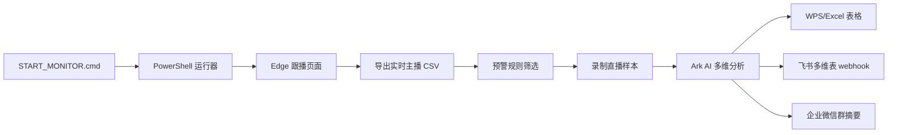

# AI 经纪人项目 HTML PPT 生成文档

## 1. PPT 定位

### 目标

制作一份适合老板观看、也可用于对外展示的 HTML 形式 PPT，完整讲清楚“AI 经纪人”项目从业务问题、方案设计、开发迭代、技术实现到最终效果的全过程。

### 受众

- 主要受众：老板、管理层、运营负责人。
- 次要受众：外部合作方、技术或产品同事。

### 表达重点

- 业务价值优先：为什么要做、解决了什么问题、带来了什么效率提升。
- 技术细节适中：展示系统链路、模块架构、AI 分析逻辑、自动化能力，但不做代码教学。
- 演示效果强：要有流程动效、真实数据卡片、截图/视频/表格/企业微信消息等产物展示。

### 敏感信息处理

可以展示真实主播案例、真实运行数据、真实分析结果，但以下内容必须遮挡或不展示：

- API Key。
- webhook 完整链接中的 key/token。
- 可直接访问内部系统的完整敏感链接。
- 如对外演示，主播 ID 和抖音号可保留部分数字，例如 `2379****2125`。

---

## 2. 推荐 HTML PPT 技术方案

### 推荐实现

使用单文件 HTML + CSS + JavaScript 实现，建议采用自定义全屏幻灯片，而不是依赖复杂框架。

原因：

- 便于离线演示。
- 可嵌入截图、视频、流程图和局部动效。
- 方便后续转 PDF 或直接浏览器播放。
- 不需要安装额外服务。

### 基础交互

- 左右方向键切换页面。
- 空格切下一页。
- 页面右下角显示页码。
- 首页支持点击“开始演示”。
- 重要流程页使用分步高亮动画。
- 视频演示页支持自动静音循环播放或点击播放。

### 视觉风格

整体风格：科技感、运营管理感、实战项目感。

建议配色：

- 背景主色：深色蓝黑 `#07111f`。
- 强调色：电光蓝 `#4ea1ff`、青绿 `#24d6a3`。
- 预警色：橙红 `#ff7a45`。
- 卡片底色：`rgba(255,255,255,0.06)`。
- 正文文字：`#e8eef8`。
- 弱化文字：`#9fb0c7`。

字体：

- 中文：`Microsoft YaHei`, `PingFang SC`, `Noto Sans SC`。
- 数字：可用 `DIN`, `Inter`, `Arial`。

风格要求：

- 避免花哨模板感。
- 避免大段文字。
- 每页一个核心观点。
- 多用流程线、数据卡、真实产物截图、对比图。

---

## 3. 可用真实素材

### 项目代码结构

当前项目根目录：

```text
ai_broker/              新版 Python 模块
scripts/                PowerShell 运行器
daily_data/             每日运行数据
analysis_config.json    唯一配置入口
START_MONITOR.cmd       双击启动入口
requirements.txt        依赖
README.md               项目说明
```

### 真实产物规模

截至当前数据目录统计：

```text
运行日期目录：20260623、20260624、20260625、20260626、20260628、20260629
CSV 导出文件：125 个
AI 结果 JSON：584 个
录制视频 MP4：380 个
截图 JPG：371 个
日志 LOG：110 个
本地分析表 XLSX：2 个
```

### 最新一次完整运行示例

可用于演示的最新日志片段：

```text
已生成: daily_data\20260629\exports\实时主播数据-20260629-215643-含预警标记.csv
行数: 199
预警主播: 5，今日待分析: 1
已保存片段: ...mp4
已保存音频: ...m4a
已保存截图: ...jpg
开始 AI 分析，并发数: 1，提交间隔: 5 秒
已写入本地表格: ...预警主播分析_20260629.xlsx
已发送飞书表格 webhook: 5 条
已发送企业微信新增预警主播汇总: 1 个
```

### 最新预警规则

```text
开播大于 3 小时，且累计观众和音浪/流水都小于 2000
```

### 最新 CSV 示例

```text
文件：实时主播数据-20260629-215643-含预警标记.csv
总行数：199
预警主播：5
```

预警样例：

| 主播昵称 | 抖音号/短ID | 对应运营 | 累计观众 | 音浪/流水 |
|---|---:|---|---:|---:|
| 鱼小小 | 95561411401 | 李仁创组-赵振霖（松） | 1078 | 646 |
| 思杰 | 46662024147 | 朱永明组-朱朝伟（松） | 280 | 16 |
| 枳枳🦖 | 91130336031 | 林文鹏组-曲延靖（现) | 285 | 1167 |
| 小狗子 | 23795282125 | 林文鹏组-曲延靖（现) | 267 | 610 |
| 菜菜 | 43743419330 | 林文鹏组-李鑫 | 361 | 780 |

### AI 分析案例

案例：小狗子 / 23795282125 / 林文鹏组-曲延靖（现)

运营维度结论：

```text
该主播连麦全程闲聊划水，无进房钩子和礼物引导，3小时场观和音浪极低，当前在线仅2人，完全无法承接高价值用户转化。
```

调试维度结论：

```text
现有样本未观测到音画卡顿、爆音等硬故障，暂未发现明显调试问题，无法确认是否存在隐性参数瑕疵。
```

案例：鱼小小 / 95561411401 / 李仁创组-赵振霖（松）

运营维度结论：

```text
主播开播超3小时场观不足千、音浪仅543，承接链路全断，无进房钩子、转化引导弱，未撬动高价值用户打赏，直接拉低整体数据。
```

调试维度结论：

```text
受采样压缩影响，未发现明显硬故障，但人声伴奏比例失衡，听感体验差，间接降低用户停留意愿，阻碍音浪提升。
```

---

## 4. PPT 整体结构

推荐 20 页左右，节奏如下：

```text
01 封面
02 一句话介绍项目
03 业务背景和痛点
04 原始工作流的问题
05 项目目标
06 方案总览
07 自动化流程图
08 预警规则设计
09 数据采集链路
10 视频/音频采样设计
11 AI 分析维度
12 输出结果设计
13 真实案例展示
14 飞书/WPS/企微联动效果
15 工程架构演进
16 重构前后对比
17 关键难点和解决方案
18 项目收益
19 项目心得
20 下一步规划
21 结束页
```

---

## 5. 逐页生成规格

### Slide 01 封面

标题：

```text
AI 经纪人：直播预警主播自动分析系统
```

副标题：

```text
从人工巡检到自动录制、AI 分析、表格沉淀与群通知
```

页面元素：

- 背景使用深色科技网格或抽象直播数据流。
- 中央大标题。
- 下方三枚标签：
  - 实时预警
  - AI 多维诊断
  - 自动沉淀到表格

讲解重点：

- 这是一个围绕“娱播主播预警分析”的自动化项目。
- 核心目标是帮助运营更快发现问题、形成复盘材料、推动主播调整。

动画：

- 标题淡入。
- 三个标签依次出现。

---

### Slide 02 项目一句话

标题：

```text
一句话：让系统自动发现低效直播间，并给出可执行改进建议
```

正文：

```text
系统每轮自动读取跟播列表，筛出预警主播，录制 60 秒直播片段，调用 AI 从运营、调试、妆造、才艺、声乐五个维度诊断，并自动写入表格和企业微信群。
```

视觉：

中间放一个横向链路：

```text
直播数据 → 预警筛选 → 录制样本 → AI 分析 → 表格沉淀 → 群通知
```

讲解重点：

- 不是单纯的 AI 问答，而是一条完整自动化工作流。
- 运营拿到的是结构化结论，不是零散聊天记录。

---

### Slide 03 业务背景

标题：

```text
业务背景：娱播收入高度依赖高价值用户打赏转化
```

三张卡片：

1. 收入核心
   ```text
   主播需要承接进房用户，尤其是高价值付费用户和大哥。
   ```
2. 问题暴露慢
   ```text
   低场观、低音浪的直播间，如果不及时发现，会持续浪费流量和直播时长。
   ```
3. 运营压力大
   ```text
   人工逐个看直播、录屏、总结问题，效率低且标准不统一。
   ```

视觉：

- 左侧是直播间漏斗：进房 → 停留 → 互动 → 关注 → 打赏。
- 右侧是“断点”：低停留、低互动、低音浪。

讲解重点：

- 项目不是为了“炫技”，而是围绕打赏转化链路服务。

---

### Slide 04 原始工作流痛点

标题：

```text
人工巡检的问题：慢、散、不稳定
```

对比表：

| 环节 | 人工方式 | 问题 |
|---|---|---|
| 找主播 | 手动看跟播列表 | 容易遗漏 |
| 判断预警 | 看时长、场观、音浪 | 标准不统一 |
| 看直播 | 人工点进直播间 | 耗时 |
| 写结论 | 运营凭经验总结 | 粗细不一 |
| 跟进通知 | 手动发群/填表 | 容易断档 |

页面强调语：

```text
真正需要自动化的不是“看一眼数据”，而是把发现、分析、沉淀、通知串起来。
```

---

### Slide 05 项目目标

标题：

```text
项目目标：把预警主播分析变成可复制的标准流程
```

四个目标：

1. 自动发现
   ```text
   按统一规则筛出低效直播间。
   ```
2. 自动取证
   ```text
   自动录制 60 秒视频、音频和截图。
   ```
3. 自动诊断
   ```text
   AI 按五个维度输出详细问题和建议。
   ```
4. 自动沉淀
   ```text
   写入本地表格、飞书多维表，并发送企业微信群摘要。
   ```

视觉：

- 四个阶段用数字卡片排列。
- 每张卡片下方显示一个真实产物图标：CSV、MP4、JSON、XLSX/群消息。

---

### Slide 06 方案总览

标题：

```text
系统方案：一键启动，后台完成整条链路
```

流程图：



讲解重点：

- 用户日常只需要双击入口。
- 系统会复用已登录 Edge，不需要重复登录。
- 输出结果会自动沉淀，避免只停留在聊天消息里。

---

### Slide 07 自动化流程细节

标题：

```text
每一轮自动运行做了什么？
```

时间线：

1. 检查 Edge 调试端口。
2. 读取跟播列表页面数据。
3. 补全主播卡片信息。
4. 历史回填昵称/抖音号。
5. 生成带预警标记的 CSV。
6. 跳过今天已经分析过的主播。
7. 录制 60 秒直播样本。
8. 生成 AI 请求预览。
9. 调用 AI 分析。
10. 写表和通知。

真实日志片段卡片：

```text
行数: 199
预警主播: 5，今日待分析: 1
已保存片段 / 音频 / 截图
已发送飞书表格 webhook: 5 条
已发送企业微信新增预警主播汇总: 1 个
```

---

### Slide 08 预警规则设计

标题：

```text
预警规则：先找到“值得运营立刻关注”的直播间
```

当前规则：

```text
开播大于 3 小时
且累计观众 < 2000
且音浪/流水 < 2000
```

解释：

- 开播超过 3 小时：说明已经有足够时间观察直播表现。
- 累计观众低：说明曝光/承接/内容吸引存在问题。
- 音浪低：说明互动和打赏转化没有形成。

页面视觉：

- 一个三条件漏斗。
- 三个条件全部满足时，右侧亮起“预警主播”。

补充：

规则统一在 `analysis_config.json`，以后改阈值不需要改代码。

---

### Slide 09 数据采集链路

标题：

```text
数据采集：复用已登录 Edge，直接读取跟播列表数据
```

说明：

```text
系统通过 Edge 调试端口连接已登录页面，在页面上下文中请求跟播列表接口，获取主播实时指标、直播间 ID、FLV 拉流地址等信息。
```

技术细节适度展示：

```text
Edge 登录态
  ↓
页面内 fetch 接口
  ↓
实时主播数据
  ↓
补全主播卡片信息
  ↓
生成 CSV
```

展示字段：

- 主播昵称
- 抖音号/短ID
- 对应运营
- 开播时长
- 当前人气
- 累计观众
- 音浪/流水
- FLV 拉流地址
- 是否预警主播

---

### Slide 10 数据稳定性处理

标题：

```text
平台接口不稳定：系统增加历史回填机制
```

问题：

```text
有些主播接口偶发不返回昵称或抖音号，但主播 ID、直播间、标题、运营、流水等数据仍然存在。
```

解决：

```text
按主播 ID 从当天历史 CSV、已分析状态、AI 结果中回填昵称和抖音号。
```

真实日志：

```text
已从历史数据回填主播昵称/抖音号: 59 个
```

讲解重点：

- 这个能力解决了“接口未返回”导致飞书表、企业微信群消息显示不完整的问题。
- 对老板讲：系统不仅能跑，还考虑了真实业务系统接口波动。

---

### Slide 11 直播样本采集

标题：

```text
自动取证：每个预警主播保留视频、音频和截图
```

当前采样参数：

| 项目 | 配置 |
|---|---|
| 录制时长 | 60 秒 |
| 视频宽度 | 960 |
| 分析抽帧 | 2 fps |
| 输出帧率 | 15 fps |
| 音频码率 | 128k |
| 截图宽度 | 1280 |

视觉：

三张产物卡：

- `.mp4` 直播片段
- `.m4a` 音频
- `.jpg` 截图

讲解重点：

- AI 不是只看静态数据，而是结合真实直播画面和声音。
- 样本可回放，便于运营复盘。

---

### Slide 12 AI 分析维度

标题：

```text
五个维度：围绕直播转化链路做诊断
```

五张卡：

1. 运营维度
   ```text
   进房欢迎、互动承接、礼物引导、大哥维护。
   ```
2. 调试维度
   ```text
   音画稳定、人声伴奏比例、麦距、底噪、卡顿。
   ```
3. 妆造维度
   ```text
   上镜状态、人设匹配、服装妆容、背景记忆点。
   ```
4. 才艺维度
   ```text
   节目完整度、点歌机制、礼物触发、内容节奏。
   ```
5. 声乐维度
   ```text
   音准、节奏、咬字、气息、音色情绪。
   ```

讲解重点：

- 五个维度不是泛泛评价，而是围绕“停留、互动、关注、打赏”。

---

### Slide 13 AI 输出结构

标题：

```text
AI 输出不是一句话，而是一份可执行诊断单
```

每个维度输出：

```text
维度结论
证据摘要
问题诊断
转化影响
优化建议
10分钟内立刻执行
下次开播前准备
优先级
摘要消息
```

视觉：

用一张“诊断报告卡片”展示字段结构。

讲解重点：

- 输出结果能直接进入表格。
- “10 分钟内立刻执行”让运营可以马上介入，而不是只做复盘。

---

### Slide 14 真实案例展示

标题：

```text
真实案例：从低数据主播到具体改进动作
```

案例信息：

```text
主播：小狗子
抖音号：23795282125
运营：林文鹏组-曲延靖（现)
累计观众：267
音浪/流水：610
```

运营维度结论：

```text
该主播连麦全程闲聊划水，无进房钩子和礼物引导，3小时场观和音浪极低，当前在线仅2人，完全无法承接高价值用户转化。
```

页面布局：

- 左侧：主播基础数据卡。
- 右侧：AI 运营维度结论。
- 下方：行动建议标签，例如：
  - 增加进房欢迎钩子
  - 设置点歌/礼物触发
  - 每 10 分钟明确一个小目标
  - 运营即时介入提醒

---

### Slide 15 真实案例二

标题：

```text
AI 不只看数据，也能结合画面和声音判断问题
```

案例：

```text
主播：鱼小小
抖音号：95561411401
运营：李仁创组-赵振霖（松）
累计观众：1078
音浪/流水：646
```

AI 结论：

```text
主播开播超3小时场观不足千、音浪仅543，承接链路全断，无进房钩子、转化引导弱，未撬动高价值用户打赏，直接拉低整体数据。
```

调试维度：

```text
受采样压缩影响，未发现明显硬故障，但人声伴奏比例失衡，听感体验差，间接降低用户停留意愿，阻碍音浪提升。
```

讲解重点：

- AI 会区分“素材压缩影响”和“真实直播间问题”。
- 避免误判设备问题。

---

### Slide 16 输出沉淀

标题：

```text
结果沉淀：从一次分析变成可追踪运营资产
```

输出位置：

```text
daily_data/YYYYMMDD/exports            实时主播 CSV
daily_data/YYYYMMDD/clips              视频、音频、截图
daily_data/YYYYMMDD/request_previews   AI 请求预览
daily_data/YYYYMMDD/ai_results         AI 分析 JSON
daily_data/YYYYMMDD/analysis_table     本地 WPS/Excel 表格
daily_data/YYYYMMDD/logs               运行日志
daily_data/YYYYMMDD/state              已分析状态
```

视觉：

文件夹树 + 右侧实际产物数量：

```text
CSV 125
AI JSON 584
MP4 380
JPG 371
LOG 110
XLSX 2
```

---

### Slide 17 飞书/WPS/企微联动

标题：

```text
自动同步：分析结果进入表格，预警摘要进入群
```

展示三联屏：

1. WPS/Excel 表格
   ```text
   每个主播按五个维度写入 5 行结构化记录。
   ```
2. 飞书多维表
   ```text
   通过 webhook 自动新增记录，方便团队协同查看。
   ```
3. 企业微信群
   ```text
   每轮新增预警主播自动发摘要，并附表格链接。
   ```

企业微信消息格式：

```text
新增预警主播
1.主播昵称：小狗子，抖音号：23795282125，运营：林文鹏组-曲延靖（现)
表格链接：点击打开飞书表格
```

---

### Slide 18 工程架构演进

标题：

```text
工程演进：从两个大脚本重构为清晰模块
```

重构前：

```text
analyze_warning_anchors.py      预警、录制、AI、写表、通知全部混在一起
export_bytedance_live_data.py   导出、补全、规则判断混在一起
```

重构后：

```text
ai_broker/
  exporter.py     数据导出
  capture.py      录制
  ai_client.py    AI
  outputs.py      输出
  rules.py        规则
  state.py        状态
  pipeline.py     流程编排
```

核心代码量：

```text
旧核心代码约 2182 行
新核心代码约 1492 行
```

讲解重点：

- 重构不是为了“好看”，而是为了后续规则、输出、模型、维度调整都更安全。

---

### Slide 19 关键技术难点

标题：

```text
项目难点：不是调用 AI，而是让整条链路稳定跑
```

四个难点：

1. 页面登录态复用
   ```text
   通过 Edge 调试端口复用已登录页面，避免重复登录和鉴权复杂度。
   ```
2. 接口字段不稳定
   ```text
   对昵称、抖音号缺失增加历史回填。
   ```
3. 视频音频成本控制
   ```text
   60 秒样本、低帧率抽帧、压缩视频和音频，兼顾分析质量和成本。
   ```
4. 自动输出可靠性
   ```text
   飞书 webhook、企业微信、WPS 表格分别处理，并写状态避免重复。
   ```

---

### Slide 20 项目收益

标题：

```text
项目收益：把运营判断从“靠人盯”变成“系统先筛、AI 先诊断”
```

收益卡片：

1. 更快发现问题
   ```text
   每轮自动筛出低效直播间，减少人工漏看。
   ```
2. 分析更标准
   ```text
   五个维度统一输出，避免每个运营写法不同。
   ```
3. 复盘有证据
   ```text
   视频、音频、截图、JSON、表格全部留存。
   ```
4. 跟进更及时
   ```text
   企业微信群自动提醒，表格自动沉淀。
   ```

建议加入一句总结：

```text
系统不是替代运营，而是让运营更早、更准、更有依据地介入。
```

---

### Slide 21 项目心得

标题：

```text
项目心得：AI 项目的关键在“业务闭环”，不是单点模型能力
```

心得：

1. 先定义业务判断标准，再接 AI。
2. AI 输出必须结构化，否则无法沉淀和协同。
3. 真实业务系统一定会遇到接口缺字段、超时、重复处理等问题。
4. 自动化要考虑“从发现到通知”的完整闭环。
5. 配置必须统一，否则后期维护成本会迅速上升。
6. 重构越早做越好，项目越跑越复杂时再拆会更痛。

视觉：

- 用“踩坑 → 方案 → 收益”的三段式卡片展示。

---

### Slide 22 下一步规划

标题：

```text
下一步：从自动分析走向运营闭环管理
```

规划：

1. 预警分级
   ```text
   按严重程度区分高/中/低优先级。
   ```
2. 趋势追踪
   ```text
   统计同一主播连续多轮表现，判断是否改善。
   ```
3. 运营看板
   ```text
   汇总每个运营名下预警主播数量、问题类型和处理结果。
   ```
4. 闭环反馈
   ```text
   增加“已处理/待复盘/已改善”状态。
   ```
5. 模型评估
   ```text
   抽样对比 AI 结论和资深运营判断，持续优化提示词。
   ```

---

### Slide 23 结束页

标题：

```text
AI 经纪人：让直播运营更快发现问题，更准推动调整
```

副标题：

```text
从数据预警、直播取证、AI 诊断到结果沉淀的一体化流程
```

页面元素：

- 一条完整闭环流程线：

```text
发现 → 取证 → 分析 → 沉淀 → 通知 → 跟进
```

结束语：

```text
目标不是多一个工具，而是让每一轮直播问题都能被及时发现、被准确解释、被持续跟进。
```

---

## 6. HTML PPT 页面实现要求

### 页面尺寸

使用 16:9：

```css
.slide {
  width: 100vw;
  height: 100vh;
  aspect-ratio: 16 / 9;
}
```

### 基础布局

每页建议结构：

```html
<section class="slide">
  <div class="slide-kicker">项目背景</div>
  <h1>页面标题</h1>
  <div class="content">...</div>
  <div class="page-number">03 / 23</div>
</section>
```

### 推荐组件

需要实现以下通用组件：

- `MetricCard`：数据卡片。
- `FlowStep`：流程节点。
- `CodePanel`：代码/配置展示。
- `CaseCard`：真实案例卡。
- `SplitView`：左图右文或左文右图。
- `Timeline`：项目流程/迭代时间线。
- `FileTree`：目录结构展示。

### 动画建议

使用 CSS transition 即可，不要过重：

- 页面切换：透明度 + 轻微位移。
- 流程节点：依次点亮。
- 数据卡片：数字上浮淡入。
- 架构页：模块从中间向外展开。

### 媒体建议

可从以下目录挑选真实素材：

```text
daily_data/20260629/clips/*.mp4
daily_data/20260629/clips/*.jpg
daily_data/20260629/analysis_table/*.xlsx
daily_data/20260629/logs/*.log
daily_data/20260629/ai_results/*.json
```

如果 HTML 直接引用本地文件，建议将要展示的素材复制到：

```text
ppt_assets/
  screenshots/
  videos/
  data/
```

---

## 7. 演示节奏建议

总时长建议：12-18 分钟。

节奏：

```text
1-3 页：快速说明项目是什么
4-6 页：讲业务问题和整体方案
7-13 页：讲核心流程和 AI 分析逻辑
14-17 页：展示真实效果
18-19 页：讲工程架构和难点
20-23 页：讲收益、心得和规划
```

讲解时要避免陷入代码细节。老板更关心：

- 这个项目解决了什么业务问题。
- 是否已经跑通。
- 输出结果是否能被运营使用。
- 后续能否继续扩展。

技术细节只服务于证明：

- 系统不是手工拼凑。
- 流程稳定可复用。
- 后续维护成本可控。

---

## 8. 生成 HTML PPT 时的注意事项

### 必须保留

- 项目名称：AI 经纪人。
- 核心闭环：发现 → 取证 → 分析 → 沉淀 → 通知 → 跟进。
- 五个分析维度：运营、调试、妆造、才艺、声乐。
- 当前预警规则：开播大于 3 小时，累计观众和音浪/流水都小于 2000。
- 真实效果：CSV、视频/音频/截图、AI JSON、WPS/飞书/企微。

### 必须避免

- 不要展示完整 webhook token。
- 不要展示 API Key。
- 不要把 PPT 做成纯技术文档。
- 不要堆满代码截图。
- 不要把 AI 描述成“完全替代运营”，应表达为“辅助运营更快判断和跟进”。

### 对外展示建议

如果用于对外展示，建议：

- 主播抖音号部分打码。
- 企业微信机器人链接打码。
- 飞书链接只展示页面名称，不展示完整 URL。
- 保留真实流程、真实产物、真实效果。

---

## 9. 可直接用于页面的关键文案

### 项目口号

```text
让预警主播从“人工发现”变成“系统自动发现”，从“经验判断”变成“有证据的 AI 诊断”。
```

### 价值总结

```text
系统把直播数据、直播样本、AI 分析、表格沉淀和群通知串成一条闭环，让运营团队更快发现低效直播间，更准定位问题，更及时推动主播调整。
```

### 技术总结

```text
项目通过复用 Edge 登录态采集实时数据，结合 ffmpeg 自动录制直播样本，再调用 Ark 多模态模型生成结构化分析，最终通过 WPS、飞书和企业微信完成结果沉淀与通知。
```

### 心得总结

```text
AI 项目真正落地的关键，不是单次模型回答有多漂亮，而是能否稳定进入业务流程，形成可追踪、可复盘、可执行的闭环。
```

