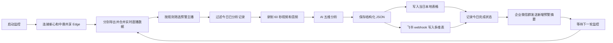

# AI 经纪人项目完整流程

> 项目：新心文化 AI 经纪人  
> 用途：自动识别低效直播间，录制直播样本，通过 AI 从五个维度形成诊断，并同步到本地表格、飞书多维表和企业微信群。  
> 本文依据当前项目代码和 `analysis_config.json` 整理，可用于项目汇报、日常操作、维护交接和故障排查。

## 一、项目目标

娱播的核心收入来自用户停留、互动、关注和打赏，其中高价值付费用户的承接能力直接影响直播间流水。人工巡检需要运营逐个进入直播间、观察表现、记录问题并跟进，存在覆盖有限、标准不统一、反馈不及时和复盘资料分散等问题。

AI 经纪人的目标不是替代运营，而是把重复、耗时的首轮巡检自动化：

1. 自动读取当前正在直播的主播及实时指标。
2. 按统一规则筛选需要重点关注的预警主播。
3. 自动录制 60 秒视频、音频和截图，保留可复核证据。
4. 使用 AI 从运营、调试、妆造、才艺、声乐五个维度分析问题。
5. 输出具体到话术、动作和准备事项的改进建议。
6. 自动写入当天的本地 WPS/Excel 表格和飞书多维表。
7. 每轮完成后向企业微信群发送新增预警主播汇总和表格链接。
8. 保存每日状态，同一主播同一直播间当天不重复分析。

## 二、项目建设过程

### 1. 从人工巡检到自动预警

项目最初解决的是“哪些主播需要先看”的问题。系统从直播数据中读取开播时长、累计观众和音浪/流水，根据统一阈值自动筛选预警主播，减少人工逐个排查的时间。

### 2. 从简短结论到五维详细诊断

早期分析内容较短，不足以直接指导主播调整。之后逐步细化提示词，并将样本时长增加到 60 秒，使 AI 能观察前段、中段和后段的节奏变化。目前保留五个有效维度：

- 运营维度：进房承接、互动、关注、礼物破冰、大哥维护和直播节奏。
- 调试维度：人声、伴奏、爆音、底噪、音画同步、设备、网络和灯光状态。
- 妆造维度：妆容、发型、服装、人设匹配、背景、姿态和镜头表现。
- 才艺维度：才艺完成度、差异化、节目结构以及才艺与礼物转化的结合。
- 声乐维度：音准、节奏、咬字、气息、音色、情绪、麦距和伴奏比例。

摄影维度已根据实际业务需求删除，当前配置、提示词和输出均以这五个维度为准。

### 3. 从群内长文本到结构化表格

分析结果最初直接发送到微信群，信息较长且不利于检索、筛选和长期复盘。项目随后改为：

- 本地每天生成一个 WPS/Excel 表格，作为本地备份。
- 通过飞书工作流 webhook 自动写入飞书多维表。
- 企业微信群只发送本轮新增预警主播摘要和飞书表格链接。

### 4. 从脚本堆叠到模块化项目

项目已按职责拆分为配置、数据导出、预警规则、录制、AI 调用、结果输出、状态管理和主流程编排等模块。所有业务阈值、分析维度、录制参数和输出开关统一放在 `analysis_config.json`，日常调整不需要在多个 Python 文件中重复修改。

## 三、完整业务闭环



每一轮只对本轮成功完成 AI 分析的主播进行入表和通知。录制失败、AI 请求失败或飞书写入失败时，程序会输出错误并保留日志，便于后续重跑和排查。

## 四、程序每轮实际执行流程

### 第 1 步：启动程序

日常使用时双击项目根目录下的 `START_MONITOR.cmd`。它会调用 `scripts/ai_broker.ps1` 并进入持续监控模式。

运行器主要负责：

- 设置 UTF-8 输出，避免中文乱码。
- 检查 `ARK_API_KEY` 环境变量。
- 检查新心和中鼎两个 Edge 远程调试端口。
- 任一后台未启动或未登录时给出明确错误，不进入后续分析。
- 调用 Python 主程序完成一轮分析。
- 保存本轮日志。
- 按配置的分钟数倒计时，然后开始下一轮。

关闭窗口或按 `Ctrl+C` 即停止监控。

### 第 2 步：复用 Edge 登录状态

系统不会在代码中保存抖音账号和密码，而是通过 Playwright 连接“直播数据导出”项目维护的两个 Edge 调试端口，复用新心和中鼎已经登录的后台状态。新心使用 `9223`，中鼎使用 `9224`。

程序会分别在两个 Edge 会话中寻找跟播列表页；如果没有找到，会在对应会话中打开 `analysis_config.json` 配置的跟播页面。

因此首次使用前需要：

1. 双击 `../直播数据导出/START_EDGE_新心.cmd` 并登录新心。
2. 双击 `../直播数据导出/START_EDGE_中鼎.cmd` 并登录中鼎。
3. 分别确认两个账号有权访问跟播列表，并保持窗口开启。

### 第 3 步：读取并补全直播数据

程序在两个已登录页面中分别调用后台接口，分批读取当前直播间数据，再合并为一份带“后台”字段的结果。主要数据包括：

- 主播昵称、主播 ID、抖音号/短 ID。
- 对应运营、直播标题、直播间 ID。
- 开播时间、开播时长、当前人气和累计观众。
- 送礼人数、音浪/流水、增长粉丝。
- FLV 拉流地址等录制所需信息。

当接口本轮没有返回昵称或抖音号时，程序会尝试从当天历史 CSV、分析状态和 AI 结果中按“后台 + 主播 ID”回填，避免跨后台错误复用身份信息。

完整导出结果保存为：

```text
daily_data/YYYYMMDD/exports/实时主播数据-YYYYMMDD-HHMMSS-含预警标记.csv
```

### 第 4 步：筛选预警主播

当前预警条件由 `analysis_config.json` 的 `warning_rule` 统一控制。现行逻辑为三个条件同时满足：

```text
开播时长 > 10800 秒（3 小时）
累计观众 < 2000
音浪/流水 < 2000
```

对应的判断逻辑是：

```text
开播时间较长，但累计观众和流水都没有达到预期
```

修改预警标准时，只修改 `analysis_config.json`，无需改 Python 代码。需要注意，程序使用的是严格的大于和小于：等于阈值时不计入预警。

### 第 5 步：过滤当天已经分析过的直播间

系统使用“主播 ID + 直播间 ID”作为当天去重键，并读取：

```text
daily_data/YYYYMMDD/state/analyzed_YYYYMMDD.json
```

如果同一主播的同一直播间当天已经成功完成分析，后续监控轮次会跳过；主播重新开播并产生新的直播间 ID 后，可以再次进入分析流程。

需要强制重跑当天记录时，可以使用 `--rerun-today` 参数。正常监控不建议开启，以免重复写表和重复通知。

### 第 6 步：并发录制直播样本

对所有待分析主播，系统从 FLV 拉流地址录制样本。当前参数为：

- 样本时长：60 秒。
- 视频宽度：960 像素。
- 保存帧率：15 fps。
- AI 视频抽帧参数：2 fps。
- 视频编码：H.264。
- 音频编码：AAC，128 kbps。
- 截图宽度：1280 像素。

每位主播会产生：

```text
daily_data/YYYYMMDD/clips/主播ID_直播间ID_时间.mp4
daily_data/YYYYMMDD/clips/主播ID_直播间ID_时间.m4a
daily_data/YYYYMMDD/clips/主播ID_直播间ID_时间.jpg
```

截图优先直接从直播流获取；若失败，则从已录制视频的中间位置提取。没有 FLV 拉流地址或录制失败的主播会被跳过，不影响其他主播继续处理。

### 第 7 步：生成 AI 请求

系统把以下内容组合成一次多模态请求：

- 60 秒视频。
- 从视频提取的音频。
- 主播实时数据。
- 当前预警原因。
- 五个维度的详细判断标准。
- 固定的结构化 JSON 输出格式。

同时生成请求预览，保存在：

```text
daily_data/YYYYMMDD/request_previews/
```

请求预览用于排查模型收到的数据和提示词是否正确。由于其中可能包含视频、音频的 Base64 数据，文件体积可能较大，不适合对外发送。

### 第 8 步：执行五维 AI 分析

AI 必须围绕“进房吸引 → 3 秒停留 → 互动承接 → 关注沉淀 → 礼物破冰 → 大哥维护 → 音浪提升”的转化链路分析。

每个维度均输出以下结构：

- 维度结论：概括核心问题及其对场观、留存或流水的影响。
- 证据摘要：说明结论来自画面、声音、直播数据或前中后段节奏。
- 问题诊断：指出阻碍曝光、停留、互动、关注或流水的具体原因。
- 转化影响：说明问题如何影响大哥停留、礼物破冰、客单或复访。
- 优化建议：具体到话术、动作、参数、机位、妆造或节目段落。
- 10 分钟内立刻执行：主播或运营当场就能完成的动作。
- 下次开播前准备：适合复盘后准备和验证的事项。
- 优先级：高、中或低。
- 摘要消息：用于表格查看的完整中文总结。

系统明确区分“主播直播间问题”和“分析样本压缩问题”。仅因低分辨率、抽帧或压缩产生的不清晰，不能直接判断为主播设备或推流问题；证据不足时，AI 必须说明需要查看原始直播流确认。

### 第 9 步：处理 AI 超时和异常

AI 请求超时时间为 240 秒。遇到限流、请求突发过快、读取超时、连接重置等可重试错误时，系统会按以下间隔重试：

```text
首次失败后等待 20 秒
第二次失败后等待 45 秒
第三次失败后等待 90 秒
最多调用 4 次
```

此外还有两层兼容处理：

- 如果接口不支持 `reasoning` 参数并返回特定 400 错误，会去掉该参数后重试。
- 如果视频加音频的请求失败，会保留视频并改为“仅视频分析”再次调用。

AI 返回后，程序优先直接解析 JSON；若模型附带了额外文字，会尝试提取其中的 JSON 对象。最终结果保存在：

```text
daily_data/YYYYMMDD/ai_results/
```

### 第 10 步：写入当天本地 WPS/Excel 表格

系统每天只使用一个本地表格，文件名包含日期：

```text
daily_data/YYYYMMDD/analysis_table/预警主播分析_YYYYMMDD.xlsx
```

同一天多次运行时，结果会继续追加到同一个文件，不会每轮新建一个表格。第二天程序会自动进入新的日期目录并生成新文件。

每位主播按五个分析维度写入 5 行。当前表格字段为：

```text
分析日期、分析时间、主播昵称、抖音号/短ID、对应运营、直播标题、
开播时长、当前人气、累计观众、音浪/流水、预警原因、维度、优先级、
维度结论、证据摘要、问题诊断、转化影响、优化建议、
10分钟内立刻执行、下次开播前准备、摘要消息
```

本地视频路径、本地音频路径、本地截图路径、本地结果 JSON、主播 ID、直播间 ID、送礼人数和增长粉丝已不再写入业务表格。

保存时先写临时文件，再替换正式文件，以降低写入过程中表格损坏的风险。运行期间不要让 WPS 或 Excel 独占锁定该文件，否则写入可能失败。

### 第 11 步：写入飞书多维表

系统将同样的五维结构转换为飞书工作流所需的 JSON，每个维度发送一次 POST 请求，因此每位主播正常会向飞书发送 5 条记录。

其中“分析日期”会转换为毫秒时间戳，以匹配飞书日期字段类型；其他字段按文本传递。相邻维度之间默认间隔 0.5 秒。

飞书 webhook 遇到网络错误或 HTTP 429、500、502、503、504 时，会按 3 秒、10 秒、30 秒进行重试。字段名称或字段类型不匹配通常属于业务配置错误，需要在飞书工作流中检查字段映射，不能依靠重试解决。

### 第 12 步：保存完成状态

本地主表和飞书 webhook 均处理后，程序会将该主播写入当天状态文件，记录：

- 完成时间。
- 主播身份和对应运营。
- 视频、音频、截图和 AI 结果路径。
- 本地表格路径。
- 已发送飞书记录数量。

状态文件既用于防止重复分析，也用于故障排查和历史身份回填。

### 第 13 步：发送企业微信汇总

一轮中所有主播处理完成后，系统只发送一条企业微信 Markdown 汇总，而不是发送五个维度的长篇分析。

格式如下：

```text
新增预警主播
1.主播昵称：AAAA，抖音号：115646515，运营：某运营
2.主播昵称：BBBB，抖音号：88668866，运营：某运营
表格链接：点击打开飞书表格
```

群内人员点击表格链接后进入飞书查看完整五维分析。若本轮没有新增成功分析的主播，则不会发送空消息。

### 第 14 步：等待下一轮

监控模式默认每 10 分钟运行一次。间隔从本轮完成后开始计算，因此实际两次开始时间的间隔等于“本轮耗时 + 监控间隔”。

每轮失败不会直接结束整个监控窗口。运行器会记录错误、继续倒计时，并在下一轮重新尝试。

## 五、配置文件说明

项目的唯一业务配置入口为：

```text
analysis_config.json
```

| 配置块 | 作用 | 常见修改内容 |
| --- | --- | --- |
| `data_root` | 所有每日数据的根目录 | 通常保持 `daily_data` |
| `ark` | AI 接口和模型参数 | 模型、温度、最大输出、推理开关 |
| `browsers` | 多后台 Edge 调试连接和跟播页 | 后台名称、调试端口、页面地址 |
| `capture` | 直播样本参数 | 录制秒数、分辨率、帧率、码率 |
| `warning_rule` | 预警筛选规则 | 最低开播时长、最高累计观众、最高流水 |
| `dimensions` | AI 分析维度 | 当前为五个维度 |
| `runtime` | 并发和循环参数 | 提交间隔、监控间隔、并发数 |
| `local_table` | 本地表格 | 开关、目录、文件名、工作表名 |
| `table_webhook` | 飞书工作流 | webhook、发送间隔、超时 |
| `wechat_summary` | 企业微信汇总 | 开关、机器人 webhook、表格链接 |

修改 JSON 后应保证逗号、双引号和括号格式正确。建议每次只修改一个配置块，保存后先运行 Preview 或 RunOnce 验证，再恢复持续监控。

安全建议：AI 密钥必须放在环境变量中。飞书和企业微信 webhook 也属于敏感凭证，对外展示或上传 GitHub 前应改用环境变量，不要将真实地址直接暴露在截图、文档或公开仓库中。

## 六、日常操作方式

### 持续自动监控

双击：

```text
START_MONITOR.cmd
```

### 完整运行一轮

```powershell
powershell -ExecutionPolicy Bypass -File .\scripts\ai_broker.ps1 -Mode RunOnce
```

该模式会依次完成：刷新数据、筛选预警、录制、AI 分析、本地写表、飞书写表和企业微信通知。

### 只预览一位主播，不调用 AI

```powershell
powershell -ExecutionPolicy Bypass -File .\scripts\ai_broker.ps1 -Mode Preview
```

适合检查 Edge 连接、数据导出、预警条件、拉流地址和录制功能。

### 只导出直播数据

```powershell
powershell -ExecutionPolicy Bypass -File .\scripts\ai_broker.ps1 -Mode Export
```

### 检查两个共享 Edge 调试会话

```powershell
powershell -ExecutionPolicy Bypass -File .\scripts\ai_broker.ps1 -Mode CheckEdges
```

## 七、每日数据目录

```text
daily_data/
└── YYYYMMDD/
    ├── exports/             实时直播数据 CSV
    ├── clips/               60 秒视频、音频和截图
    ├── request_previews/    发送给 AI 的请求预览
    ├── ai_results/          AI 原始返回和结构化结果
    ├── analysis_table/      当天唯一的 WPS/Excel 分析表
    ├── state/               当天去重和完成状态
    └── logs/                每轮运行日志
```

历史数据按日期保留。清理空间时，优先评估体积较大的 `clips` 和 `request_previews`，不要随意删除当天的 `state`，否则可能导致重复分析、重复入表和重复通知。

## 八、代码架构与职责

```text
START_MONITOR.cmd           Windows 双击入口
scripts/ai_broker.ps1       环境检查、共享 Edge 检查、日志和监控循环
analysis_config.json        唯一业务配置入口

ai_broker/main.py           命令行参数和程序入口
ai_broker/pipeline.py       一轮完整流程的编排
ai_broker/exporter.py       连接 Edge、读取接口、补全数据、导出 CSV
ai_broker/rules.py          预警条件和预警原因
ai_broker/capture.py        ffmpeg 录制视频、提取音频和截图
ai_broker/ai_client.py      提示词、请求构造、AI 调用、重试和 JSON 解析
ai_broker/outputs.py        本地表格、飞书 webhook、企业微信汇总
ai_broker/state.py          每日去重和完成状态
ai_broker/paths.py          日期目录和文件路径
ai_broker/config.py         配置读取和默认值
ai_broker/utils.py          通用数据和文件处理函数
```

架构原则是“配置与代码分离、各模块职责单一、主流程只负责编排”。例如调整预警阈值不需要修改 `rules.py`，调整分析维度不需要分别修改输出模块，所有模块都读取同一份配置。

## 九、常见故障与处理

| 现象 | 常见原因 | 处理方式 |
| --- | --- | --- |
| 没有连接到 Edge 调试端口 | 新心或中鼎 Edge 未启动 | 从“直播数据导出”项目启动对应 Edge，再运行 `CheckEdges` |
| 没有获取到直播间数据 | 对应后台登录失效、页面无权限、跟播列表为空 | 在报错所指的调试 Edge 中重新登录并确认页面能看到主播 |
| 接口未返回昵称或抖音号 | 上游接口字段缺失 | 查看是否已被历史数据回填；首次出现的主播可能仍显示“接口未返回” |
| 录制失败 | FLV 地址为空、直播结束、网络中断 | 查看日志，确认主播仍在播并重新运行 |
| AI 大量超时 | 请求并发较高、单次视频较大、模型服务繁忙或网络代理异常 | 查看具体 HTTP 错误；必要时降低并发或增加提交间隔 |
| AI 返回内容无法解析 | 模型未返回合法 JSON 或输出被截断 | 检查 `ai_results` 和日志，必要时降低输出量或重跑 |
| 飞书字段类型不匹配 | 飞书字段类型与 JSON 值不一致 | 检查工作流字段映射；日期接收毫秒时间戳，“后台”使用文本字段 |
| 本地表格写入失败 | WPS/Excel 正在独占文件或文件无权限 | 关闭表格后重跑，确认目录可写 |
| 企业微信群没有消息 | 本轮没有新增成功主播、汇总开关关闭或机器人地址失效 | 查看本轮成功数量、配置和机器人返回值 |
| 同一主播被重复分析 | 状态文件被删除、使用了 `--rerun-today` 或直播间 ID 已变化 | 检查当天 `state` 中的“后台 + 主播 ID + 直播间 ID”键 |

## 十、验收检查清单

一次完整成功运行应满足：

- 新心和中鼎 Edge 均能连接并保持后台登录。
- `exports` 中生成新的合并直播数据 CSV，且“后台”列能区分新心和中鼎。
- CSV 中预警标记符合当前阈值。
- 待分析主播在 `clips` 中生成视频、音频和截图。
- `request_previews` 中生成请求预览。
- `ai_results` 中生成五维结构化分析结果。
- 当天本地表格存在，并且每位主播新增 5 行。
- 飞书多维表出现对应的 5 条维度记录。
- 企业微信群收到一条新增预警主播汇总，并可通过链接打开飞书表格。
- `state` 中记录该主播，下一轮不再重复分析。
- `logs` 中没有未处理的致命错误。

## 十一、项目价值总结

AI 经纪人的核心价值不只是“让 AI 看一段直播”，而是把原本分散的直播巡检动作连接成一个可持续运行的业务闭环：

```text
实时数据发现问题
→ 规则筛选重点对象
→ 直播样本提供证据
→ 五维 AI 形成统一诊断
→ 表格沉淀可追踪结果
→ 群通知推动运营查看
→ 后续复盘验证改进效果
```

项目落地的关键经验有三点：

1. 模型能力必须与业务判断标准结合。只有明确观察项、转化目标和输出格式，结果才能从“泛泛点评”变成可执行建议。
2. 自动化价值来自完整闭环。只生成分析文本并不能解决管理问题，必须同时完成写表、通知、去重、日志和失败重试。
3. 结果必须可复核。保存直播样本、实时数据、AI 原始结果和状态记录，才能判断分析是否准确，并持续优化预警规则和提示词。

最终，系统把运营从重复巡检中释放出来，让有限的人力优先处理真正需要干预的主播，并为后续建立主播成长档案、运营绩效复盘和预警效果评估提供结构化数据基础。
